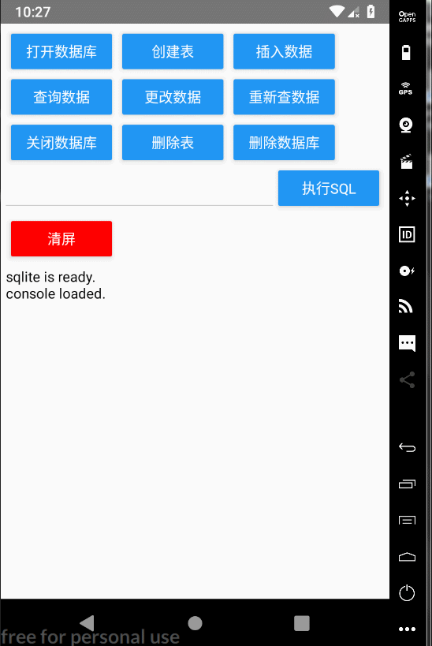

# react-native-sqlite-helper

  

This repository is based on *[andpor/react-native-sqlite-storage](https://github.com/andpor/react-native-sqlite-storage)*, you should install and link react-native-sqlite-storage first.

## Features:

(1) Use Promise

(2) Non-blocking

(3) Functional SQL

(4) Formatted return

## Usage

`npm i --save react-native-sqlite-helper`

### IOS

[linking react-native-sqlite-storage into your ios project](https://github.com/andpor/react-native-sqlite-storage#ios)

### Android

[linking react-native-sqlite-storage into your android project](https://github.com/andpor/react-native-sqlite-storage#how-to-use-android)

## Documentation

* [简体中文](./docs/zh-cn.md)

* [en](./docs/en-us.md)

## Changelog

[CHANGELOG](./CHANGELOG.md)

## License

MIT

## Sample display

